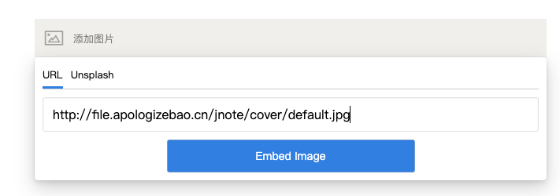

# Image
Image Tool for Editor.js 2.0

## Feature
- Embed Url ✌️ 
- Unsplash ✌️
- upload ✌️
- extend 
- image viewer ✌️ (use by viewerjs)

### tab
#### embed url


#### upsplash


#### upload


#### extend
just add any tab you wanted

---

### viewer

just double click the image


---


## Usage

Add a new Tool to the `tools` property of the Editor.js initial config.

1. npm
```nodejs
npm i @7polo/editorjs-image
```

2. init & config
```javascript
var editor = EditorJS({
  ...
  tools: {
    ...
    image: {
        class: Image,
        config: {
            unsplash: {
                search: ()=> {
                    return new Promise(function(resolve){
                        // resp from api : https://api.unsplash.com/search/photos 
                        resolve({});
                    })
                }
            },
            upload: {
                doUplaod: ()=> {
                    return new Promise(function(resolve){
                        resolve({url});
                    })
                }
            }
        }
    }
  }
  ...
});
```

## Config Params
| Field          | Type      | Description                     |
| -------------- | --------- | ------------------------------- |
| unsplash.search | function | response from unsplash https://api.unsplash.com/search/photos|

unsplash.search like this
```js
export const searchImages = (query) => {
    console.log("search" + query)

    return axios.get(`https://api.unsplash.com/search/photos`, {
        headers: {
            'Access-Control-Allow-Origin': '*',
            'Access-Control-Allow-Credentials': false,
            'Content-Type':'application/x-www-form-urlencoded'
        },
        params: {
            client_id: 'your client_id',
            query
        }
    })
}
```

## Output data

This Tool returns code.

```json
{
  "type" : "image",
  "data" : {
    "url" : "https://www.example.com/image.jpg",
    "withBorder" : false,
    "withBackground" : false,
    "stretched" : true
  }
}
```


